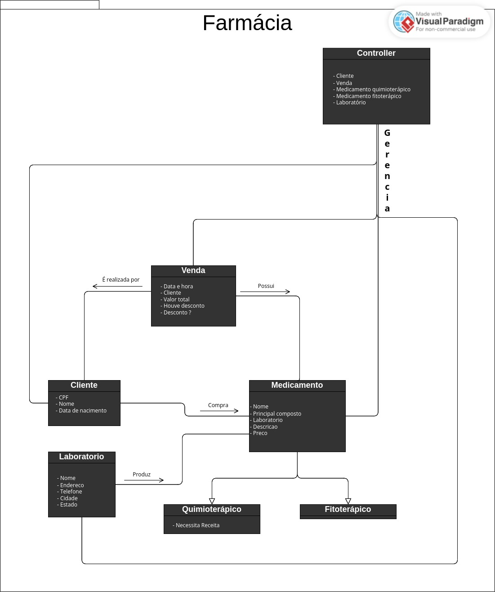

# Sistema de Gerenciamento de Farmácia

Este projeto foi realizado como projeto final de disciplina de Programação Orientadaa Objeto (POO). É um sistema de gerenciamento de uma farmácia, que foi desenvolvido em Python, seguindo os princípios de POO. Esse sistema permite cadastrar clientes, medicamentos e laboratórios, bem como realizar vendas e consultar informações relacionadas.

## Funcionalidades

- Cadastro de Clientes: Permite cadastrar informações de CPF, nome e data de nascimento para cada cliente.

- Cadastro de Medicamentos: Permite cadastrar informações de medicamentos, incluindo nome, composto, laboratório, descrição e preço. Divide medicamentos em quimioterápicos e fitoterápicos.

- Realização de Vendas: Permite registrar vendas, associando produtos e clientes. Calcula o valor total da venda e armazena as informações

- Consultas: Oferece opções para consultar informações sobre clientes, medicamento, laboratórios e histórico de vendas.

## Como Usar

#### 1. Clone o repositório para a sua máquina:

```
git clone git@github.com:AirelRibeiro/grupo_01_POO_projeto.git
```

#### 2. Navegue até o diretório do projeto:

```
cd grupo_01_POO_projeto.git
```

#### 3. Execute o arquivo principal para iniciar o sistema:

```
python3 main.py
```

#### 4. Siga as instruções no terminal para realizar ações como cadastrar clientes, medicamentos, realizar vendas e consultar informações.

## Requisitos

- Python 3.\* instalano no computador

## Estrutura do Projeto

### Diagrama de classes:



### O projeto está organizado da seguinte maneira:

- `package Farmacia`
  - `cliente.py`: Classe que representa os clientes e suas funcionalidades.
  - `laboratorio.py`: Classe que representa os laboratórios e suas funcionalidades.
  - `medicamento.py`: Classe base que representa os medicamentos e suas funcionalidades.
  - `medicamento_quimioterapico.py`: Classe que representa medicamentos quimioterápicos.
  - `medicamento_fitoterapico.py`: Classe que representa medicamentos fitoterápicos.
  - `venda.py`: Classe que representa as vendas e suas funcionalidades.
  - `controller.py`: Classe que controla as ações do sistema, como cadastros e consultas.
- `main.py`: Arquivo principal do sistema, onde as ações são executadas.
